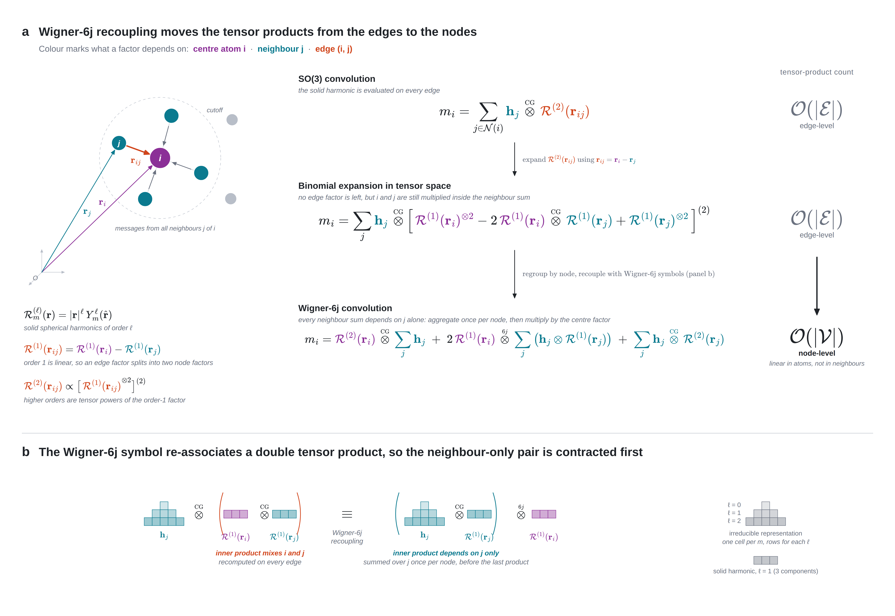

# E2Former: An Efficient and Equivariant Transformer with Linear-Scaling Tensor Products

[Paper (OpenReview)](https://openreview.net/forum?id=ls5L4IMEwt) • [Paper (arXiv)](https://arxiv.org/abs/2501.19216) • [Model Architecture](model_architecture.md) • [Quick start](#quick-start) • [Citation](#citation)

[](https://openreview.net/forum?id=ls5L4IMEwt)
[](LICENSE)
[](#installation)
[](#requirements)

E2Former is an E(3)-equivariant molecular foundation model for energy and force prediction. It combines efficient Wigner-6j-based tensor products with equivariant attention to improve scalability while preserving geometric symmetries.

The repository includes:

| Path | Purpose |
|---|---|
| `src/` | Core E2Former model components (layers, equivariant blocks, wrappers). |
| `configs/` | Experiment, dataset, and optimization YAML files. |
| `main.py` | FairChem-style training entrypoint. |
| `start_exp.py` | Background launcher for tmux-based jobs. |
| `simulate.py` | Molecular dynamics rollout entrypoint. |

## Method overview

<p align="center">
  
</p>
<p align="center">
  <em>Figure. E2Former architecture for scalable E(3)-equivariant molecular modeling.</em>
</p>

## Contents

- [Installation](#installation)
- [Quick start](#quick-start)
- [Where key code lives](#where-key-code-lives)
- [Repository layout](#repository-layout)
- [Configuration guide](#configuration-guide)
- [Documentation](#documentation)
- [Related E2Former variants](#related-e2former-variants)
- [Citation](#citation)
- [License](#license)

## Requirements

| Component | Version / Expectation |
|---|---|
| OS | Linux with NVIDIA GPU recommended |
| Python | 3.10 |
| PyTorch | 2.4.1 + CUDA 12.1 (from `env.yml`) |

## Installation

> [!TIP]
> Use `mamba` when available for faster environment solving.

### 1) Create the environment

```bash
conda env create -f env.yml
conda activate e2former
```

Or with mamba:

```bash
mamba env create -f env.yml
conda activate e2former
```

### 2) Install `fairchem-core` dependency

```bash
git clone https://github.com/FAIR-Chem/fairchem.git
pip install -e fairchem/packages/fairchem-core
```

### 3) Optional development tooling

```bash
pre-commit install
```

### 4) Optional MD dependency (`simulate.py`)

```bash
git clone https://github.com/kyonofx/MDsim.git
pip install -e MDsim
```

## Quick start

| Phase | Goal | Output |
|---|---|---|
| A) Configure | Point config to your data and experiment settings. | Ready-to-run YAML |
| B) Train | Launch single-/multi-GPU training jobs. | Checkpoints + logs |
| C) Validate / Simulate | Run smoke checks and MD rollout. | Sanity metrics + trajectories |

> [!TIP]
> Start with `configs/oc22/s2ef/e2former/e2former.yaml`, then set your dataset paths before running training.

### A) Configure data and experiment YAML

Use one of the provided templates:

- `configs/oc22/s2ef/e2former/e2former.yaml`

Before training, update dataset paths in your config:

- `dataset.train.src`
- `dataset.val.src`

### B) Train E2Former

<details open>
<summary><strong>Single GPU</strong></summary>

```bash
python main.py \
  --mode train \
  --num-gpus 1 \
  --config-yml configs/oc22/s2ef/e2former/e2former.yaml \
  --run-dir ./runs \
  --identifier e2former_oc22
```
</details>

<details>
<summary><strong>Resume from checkpoint</strong></summary>

```bash
python main.py \
  --mode train \
  --num-gpus 1 \
  --config-yml configs/oc22/s2ef/e2former/e2former.yaml \
  --run-dir ./runs \
  --identifier e2former_oc22 \
  --checkpoint /path/to/checkpoint.pt
```
</details>

<details>
<summary><strong>Background run via tmux</strong></summary>

```bash
python start_exp.py \
  --config-yml configs/oc22/s2ef/e2former/e2former.yaml \
  --mode train \
  --cvd 0 \
  --run-dir ./runs \
  --identifier e2former_bg
```
</details>

<details>
<summary><strong>Multi-GPU (single node)</strong></summary>

```bash
torchrun --standalone --nproc_per_node 4 main.py \
  --distributed \
  --num-gpus 4 \
  --mode train \
  --config-yml configs/oc22/s2ef/e2former/e2former.yaml \
  --run-dir ./runs \
  --identifier e2former_4gpu
```
</details>

### C) Validate and run MD rollout

<details open>
<summary><strong>Smoke/equivariance check</strong></summary>

```bash
python test_e2former.py
```
</details>

<details>
<summary><strong>Molecular dynamics rollout</strong></summary>

```bash
python simulate.py \
  --simulation_config_yml <SIMULATION_YML> \
  --model_dir <MODEL_DIR> \
  --model_config_yml <MODEL_CONFIG_YML> \
  --identifier <RUN_NAME>
```
</details>

## Where key code lives

| Component | Location | Main class / symbol |
|---|---|---|
| E2Former model (FairChem-facing wrapper) | `src/models/E2Former_wrapper.py` | `E2FormerBackbone` |
| E2Former core architecture (transformer stack) | `src/models/e2former_main.py` | `E2former` |
| Wigner-6j convolution primitive | `src/wigner6j/tensor_product.py` | `FullyConnectedTensorProductWigner6j` |
| Arbitrary-order E(3)-equivariant tensor product (attention) | `src/wigner6j/tensor_product.py` | `E2TensorProductArbitraryOrder` |
| Attention modules calling arbitrary-order tensor products | `src/layers/attention/orders.py` | `FirstOrderAttention`, `SecondOrderAttention`, `ArbitraryOrderAttention` |

## Repository layout

```text
.
├── configs/                   # Training, dataset, and experiment YAMLs
├── src/                       # E2Former implementation
│   ├── core/
│   ├── layers/
│   ├── models/
│   ├── utils/
│   └── wigner6j/
├── assets/                    # Figures used in README/docs
├── main.py                    # Main training/inference entrypoint
├── start_exp.py               # tmux-based background training launcher
├── test_e2former.py           # Smoke/equivariance test script
├── simulate.py                # Molecular dynamics rollout entrypoint
├── model_architecture.md      # Architecture notes
└── env.yml                    # Conda environment file
```

## Configuration guide

> [!IMPORTANT]
> Start tuning graph radius/neighbors and batch size first; these usually dominate memory and speed behavior.

Common high-impact settings:

| Config keys | Why it matters |
|---|---|
| `model.backbone.max_neighbors`, `model.backbone.max_radius` | Controls graph density and geometric context range. |
| `model.backbone.num_layers`, `model.backbone.num_attn_heads` | Main capacity/performance scaling knobs. |
| `model.backbone.attn_type`, `model.backbone.atten_name` | Selects attention formulation and kernel backend. |
| `model.backbone.use_fp16_backbone`, `model.backbone.use_compile` | Throughput and memory optimization controls. |
| `optim.batch_size`, `optim.eval_batch_size`, `optim.lr_initial` | Core optimization stability/performance parameters. |

## Documentation

Start with:

| Resource | Purpose |
|---|---|
| `model_architecture.md` | High-level architecture rationale and design notes. |
| `configs/oc22/s2ef/e2former/e2former.yaml` | Primary training template for this repository. |
| `test_e2former.py` | Smoke/equivariance checks for installation and basic model sanity. |

## Related E2Former variants

| Variant | Paper | Repository | Artifact |
|---|---|---|---|
| `E2Former-LSR` | [Scalable Machine Learning Force Fields for Macromolecular Systems Through Long-Range Aware Message Passing](https://arxiv.org/abs/2601.03774) | [IQuestLab/UBio-MolFM](https://github.com/IQuestLab/UBio-MolFM) | [UBio-E2Former-LSR](https://huggingface.co/IQuestLab/UBio-E2Former-LSR) |
| `E2Former-V2` | [E2Former-V2: On-the-Fly Equivariant Attention with Linear Activation Memory](https://arxiv.org/abs/2601.16622) | [IQuestLab/UBio-MolFM (e2formerv2)](https://github.com/IQuestLab/UBio-MolFM/tree/e2formerv2) | Included in the `e2formerv2` branch |

## Citation


If you use E2Former in your work, please cite:

OpenReview page: <https://openreview.net/forum?id=ls5L4IMEwt>

```bibtex
@inproceedings{li2025eformer,
  title={E2Former: An Efficient and Equivariant Transformer with Linear-Scaling Tensor Products},
  author={Yunyang Li and Lin Huang and Zhihao Ding and Xinran Wei and Chu Wang and Han Yang and Zun Wang and Chang Liu and Yu Shi and Peiran Jin and Tao Qin and Mark Gerstein and Jia Zhang},
  booktitle={The Thirty-ninth Annual Conference on Neural Information Processing Systems},
  year={2025},
  url={https://openreview.net/forum?id=ls5L4IMEwt}
}
```

## License
This project is released under the MIT License.

## Acknowledgments

This repository is adapted from [EScAIP](https://github.com/ASK-Berkeley/EScAIP) and [FairChem](https://github.com/FAIR-Chem/fairchem).
